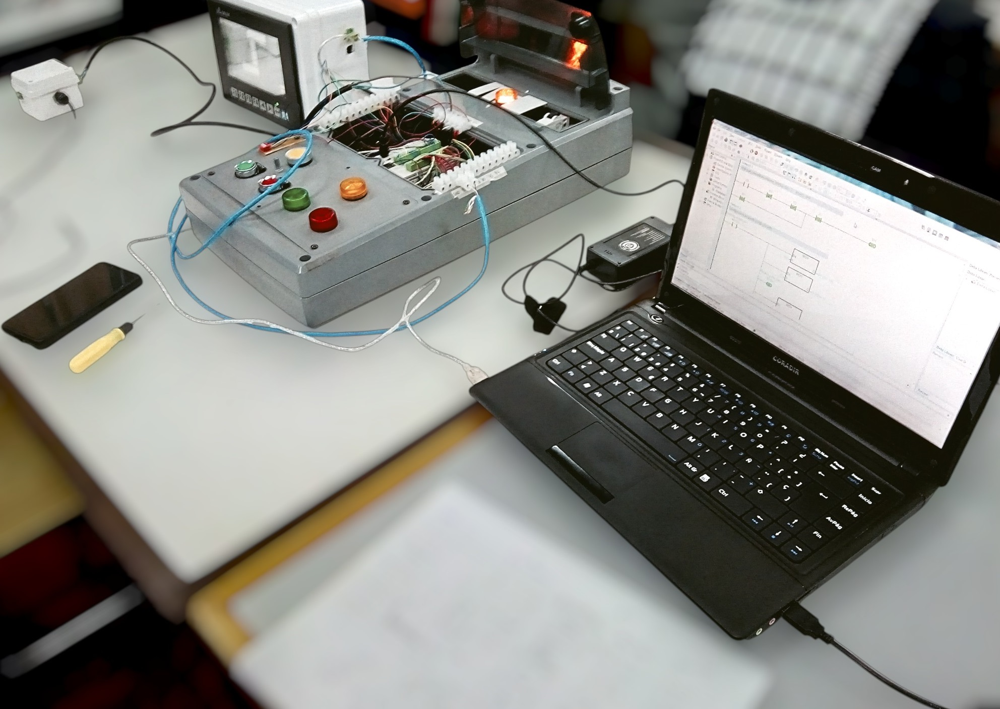
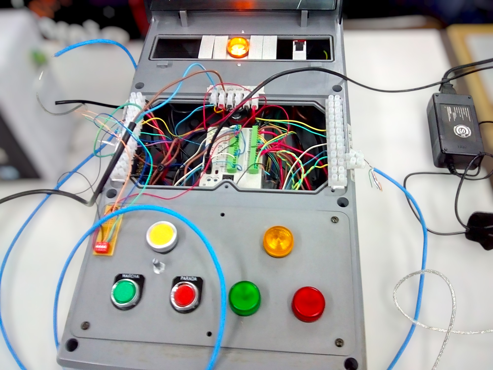
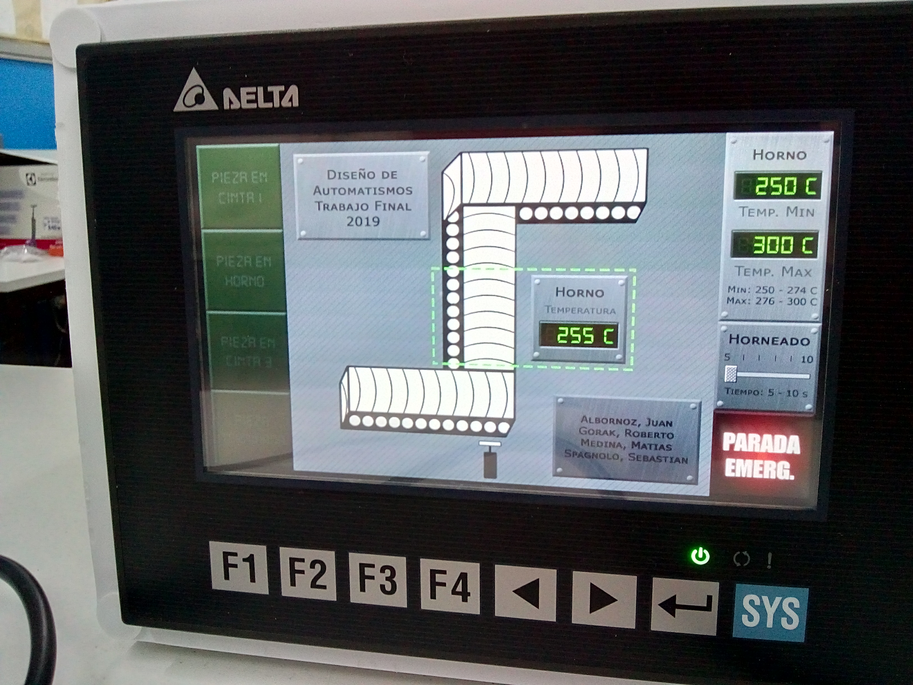

# Automated Electrostatic Paint Curing Line — Delta PLC & HMI

This project consists of the design and programming of an automated electrostatic paint curing process using a Delta PLC programmed with ISPSoft.

The system transports one product at a time through three conveyor belts, controlling three conveyor motors, a pneumatic positioning piston, four proximity sensors and an analog temperature sensor.

The PLC manages the complete production sequence, including product detection, positioning, transfer between conveyor belts, oven operation and removal of the finished product.

An HMI is used to monitor the process and interact with the system. The operator can visualize the oven temperature in real time and configure the required temperature range and the curing time that the product must remain inside the oven.

The project was developed as a final practical project for the Industrial Automation course within the Electronic Engineering degree at the National University of Mar del Plata.
